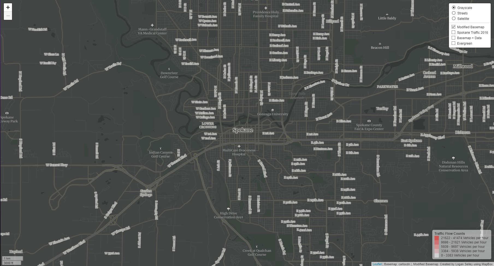
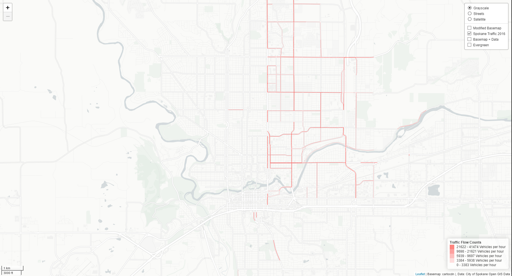
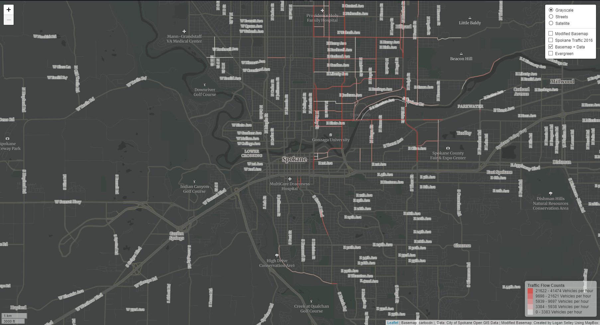
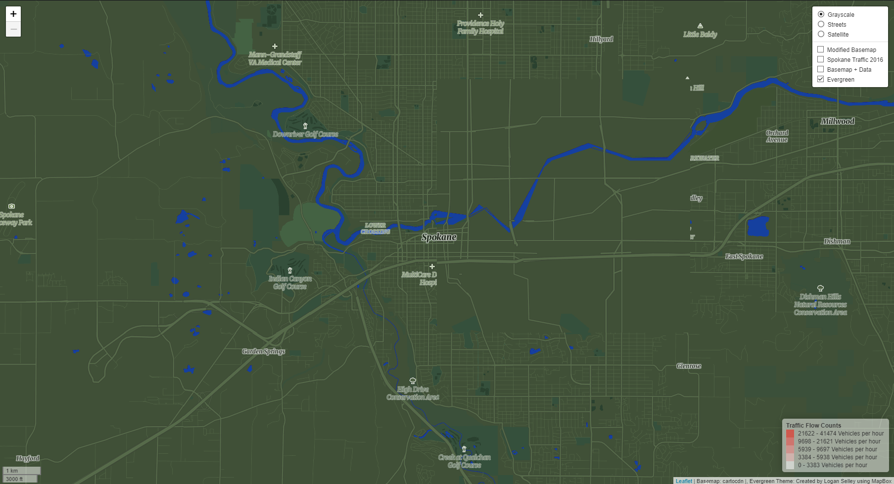

# Spokane Traffic 2016

## By Logan Selley

---

>This map examines the city of Spokane and it's available traffic flow data for the year 2016. Zoom levels 13 - 16 are available for each tileset.

## Screenshots

### Modified Basemap

>A modified monochromatic basemap created in MapBox using gray colors and lots of labeling for navigation

### Data Layer

>Traffic flow data from the [City of Spokane Open GIS Data](https://data-spokane.opendata.arcgis.com/datasets/364aa5cb82134d4895432ef2fed245ca_0) for the year 2016

### Grouped Layer

> Combination Tile Set of the first two layers

### Themed Layer

> Themed modified basemap around nature and the State's Evergreen nickname made with MapBox using dark greens and emphasizing nature and natural features

